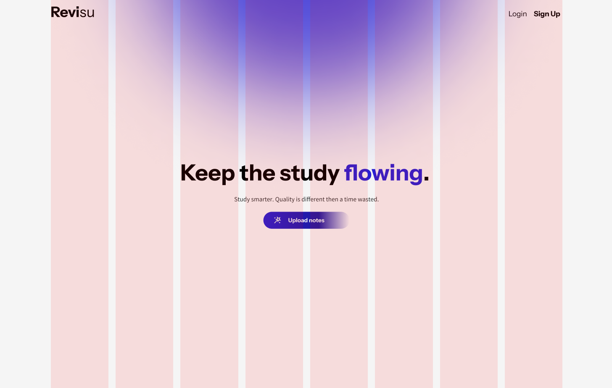

# revisu

  
  
  
  
  
  
  

Revisu é um software desenvolvido para estudantes e pesquisadores que integra notas locais do Obsidian, fornecendo análises e insights para otimizar os estudos. Ele categoriza automaticamente as notas, organizando-as de forma estruturada. Além disso, permite a criação de notas resumidas para revisões de memória espaçada e lembretes para revisitar os resumos das notas, ajudando os usuários a avaliar a memorização do conhecimento e revisar seus conteúdos de forma muito mais eficiente.

Colabore dando ideias no fluxo de desenvolvimento dentro do link compartilhado no Figma!

Acesse o link, por aqui: https://www.figma.com/design/s1fdlHEQL1Qxbvu2J1pEEj/revisu?node-id=6-2&t=DPrBou1ya4f1LIgr-1
